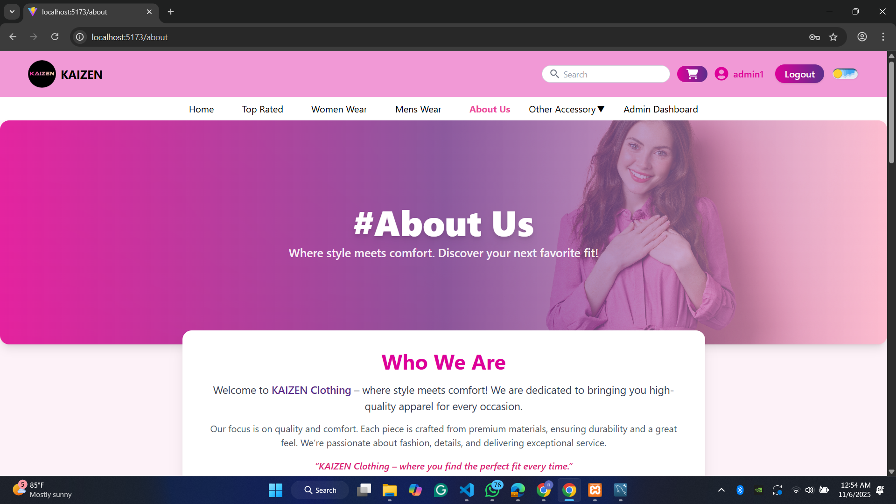
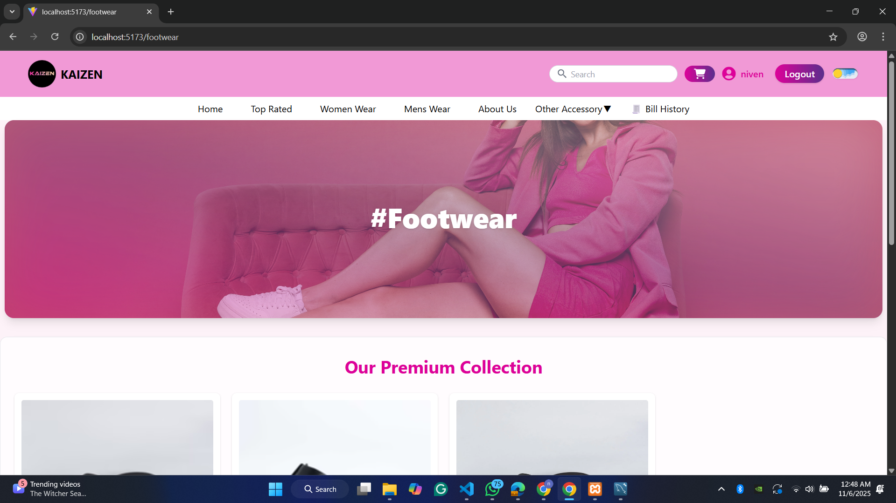
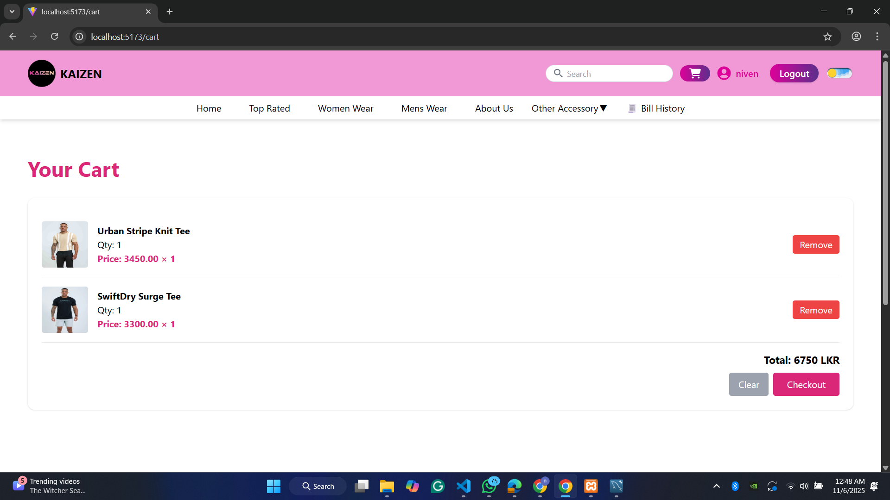
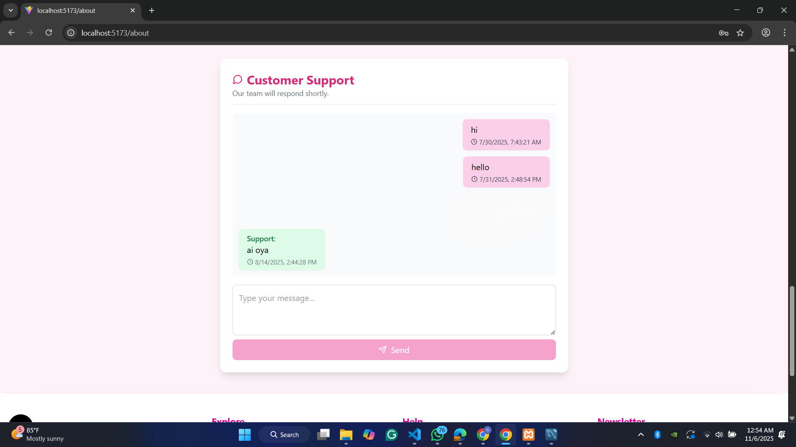

# Getting Started with Create React App

This project was bootstrapped with [Create React App](https://github.com/facebook/create-react-app).

## Available Scripts

In the project directory, you can run:

### `npm start`

Runs the app in the development mode.\
Open [http://localhost:3000](http://localhost:3000) to view it in your browser.

The page will reload when you make changes.\
You may also see any lint errors in the console.

### `npm test`

Launches the test runner in the interactive watch mode.\
See the section about [running tests](https://facebook.github.io/create-react-app/docs/running-tests) for more information.

### `npm run build`

Builds the app for production to the `build` folder.\
It correctly bundles React in production mode and optimizes the build for the best performance.

The build is minified and the filenames include the hashes.\
Your app is ready to be deployed!

See the section about [deployment](https://facebook.github.io/create-react-app/docs/deployment) for more information.

### `npm run eject`

**Note: this is a one-way operation. Once you `eject`, you can't go back!**

If you aren't satisfied with the build tool and configuration choices, you can `eject` at any time. This command will remove the single build dependency from your project.

Instead, it will copy all the configuration files and the transitive dependencies (webpack, Babel, ESLint, etc) right into your project so you have full control over them. All of the commands except `eject` will still work, but they will point to the copied scripts so you can tweak them. At this point you're on your own.

You don't have to ever use `eject`. The curated feature set is suitable for small and middle deployments, and you shouldn't feel obligated to use this feature. However we understand that this tool wouldn't be useful if you couldn't customize it when you are ready for it.

## Learn More

You can learn more in the [Create React App documentation](https://facebook.github.io/create-react-app/docs/getting-started).

To learn React, check out the [React documentation](https://reactjs.org/).

### Code Splitting

This section has moved here: [https://facebook.github.io/create-react-app/docs/code-splitting](https://facebook.github.io/create-react-app/docs/code-splitting)

### Analyzing the Bundle Size

This section has moved here: [https://facebook.github.io/create-react-app/docs/analyzing-the-bundle-size](https://facebook.github.io/create-react-app/docs/analyzing-the-bundle-size)

### Making a Progressive Web App

This section has moved here: [https://facebook.github.io/create-react-app/docs/making-a-progressive-web-app](https://facebook.github.io/create-react-app/docs/making-a-progressive-web-app)

### Advanced Configuration

This section has moved here: [https://facebook.github.io/create-react-app/docs/advanced-configuration](https://facebook.github.io/create-react-app/docs/advanced-configuration)

### Deployment

This section has moved here: [https://facebook.github.io/create-react-app/docs/deployment](https://facebook.github.io/create-react-app/docs/deployment)

### `npm run build` fails to minify

This section has moved here: [https://facebook.github.io/create-react-app/docs/troubleshooting#npm-run-build-fails-to-minify](https://facebook.github.io/create-react-app/docs/troubleshooting#npm-run-build-fails-to-minify)

# 🎯 Full-Stack Event Management & E-Commerce Web Application

A **fully functional web application** developed using **React**, **PHP (API backend)**, **Tailwind CSS**, and **MySQL Database**.
This project integrates **event management**, **product sales (POS)**, **chat support**, and **report generation** into one complete system with multi-role access control.

---

## ⚙️ Tech Stack

| Layer           | Technology                      |
| --------------- | ------------------------------- |
| **Frontend**    | React, Tailwind CSS, Vite       |
| **Backend**     | PHP RESTful API                 |
| **Database**    | MySQL                           |
| **Realtime**    | WebSockets / AJAX for live chat |
| **Build Tools** | npm, Composer                   |

---

## 🚀 Core Features

* 🛍️ **E-Commerce System** — Product listings, shopping cart, checkout
* 💵 **Payment Options** — Cash on Delivery (COD)
* 🧾 **Billing System** — Generates and stores order history and bills
* 💬 **Live Chat** — Real-time customer and support communication
* 📅 **Event Management** — Admin can add, schedule, and manage events
* 📊 **Reports Dashboard** — Daily, Weekly, and Monthly revenue reports
* 👥 **Role-based Access** — Admin, User, and Support roles
* 📦 **Product Management** — CRUD operations for inventory control
* 🌐 **Responsive UI** — Clean and modern design with Tailwind CSS

---

## 🧠 User Roles

| Role        | Access & Responsibilities                       |
| ----------- | ----------------------------------------------- |
| **Admin**   | Manage products, events, reports, and user data |
| **User**    | Browse products/events, make orders, view bills |
| **Support** | Handle live chat and user inquiries             |

---

## ⚙️ Installation & Setup

### 1️⃣ Backend Setup (PHP + MySQL)

```bash
cd backend
composer install
cp .env.example .env
# Update .env with your MySQL credentials
php -S localhost:8000 -t public
```

### 2️⃣ Frontend Setup (React)

```bash
cd frontend
npm install
npm run dev
```

Frontend URL: `http://localhost:5173`
Backend API: `http://localhost/kaizen-backend/`

---

## 🖼️ Screenshots

### 🏠 Home Page


### 🛒 Shopping / Product Page



### 👜 Bag Page


### 🥾 Footwear Page



### 🛍️ Cart Overview



### 💵 Payment Page


### 🧾 Bill / Order History


### 🧰 Product Management


### 📅 Event Schedule


### 📊 Sales Report (Admin)


### 💬 Support Chat



---

## 📂 Folder Structure

```
E-Commerce-Web/
 ├── src/
 │   ├── assets/          # All screenshots and media files
 │   ├── components/      # UI components (Navbar, Hero, Banner, etc.)
 │   ├── pages/           # Page routes (Home, Login, Bag, etc.)
 │   ├── backend/         # PHP API logic
 │   └── App.jsx
 ├── public/
 ├── package.json
 ├── tailwind.config.js
 └── README.md
```

---

## 🧾 Reports & Dashboard

* Admin can view **sales analytics** by day, week, or month.
* Access **order statistics** and generate printable summaries.
* Manage **inventory levels** and event schedules from a single dashboard.

---

## 👨‍💻 Author

**Niven Asmitha Liyanage**
📧 [nivenasmitha345@gmail.com](mailto:nivenasmitha345@gmail.com)

---

## 💡 License

This project is open-source and free to use for educational and development purposes.

---

## ⭐ Support

If you like this project, don’t forget to **star 🌟 the repo** and share it with others!

